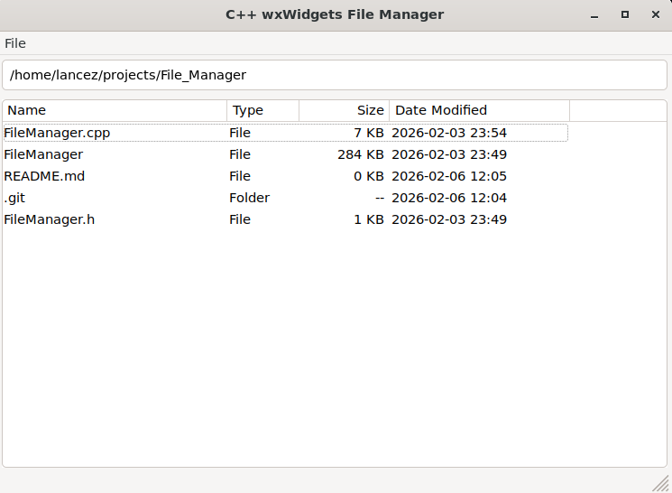

## Screenshots

Main window:  


# File Manager (wxWidgets)

A simplified graphical file manager implemented in **C++** using **wxWidgets**.  
This project was built as part of a university assignment to demonstrate GUI programming, file system operations, and event-driven design in C++.

---

## Features
The file manager supports all core file operations and a simple GUI interface:  

- **File Listing**: View files and directories with properties (name, type, size, date modified)  
- **Directory Navigation**: Change directories by typing in the text bar or double-clicking folders  
- **File Operations**:  
  - Open files using the system's default application  
  - Create new directories  
  - Rename files and directories  
  - Delete files and directories with confirmation dialogs  
  - Copy, Cut, and Paste files using a virtual clipboard  
- **User Interface Elements**:  
  - Menu or button panel for operations  
  - Status bar providing feedback on file operations  
  - Pop-ups and dialogs for input and error messages  
- **Keyboard Shortcuts**: Most operations are accessible via keyboard as well as point-and-click  
- **Refresh**: Update file listing to reflect the current directory state  
- **Exit**: Cleanly close the application  

> Note: File operations are implemented for **single files or directories** at a time. Multi-file operations are not supported for simplicity.

---

## Technologies Used
- **C++17** with the standard **filesystem library** for cross-platform file operations  
- **wxWidgets** (GUI framework)
- File I/O and filesystem operations
- Event-driven programming


---

## Usage
1. Clone the repository:  
   ```bash
   git clone https://github.com/lance-zou-k/file-manager-wxwidgets.git